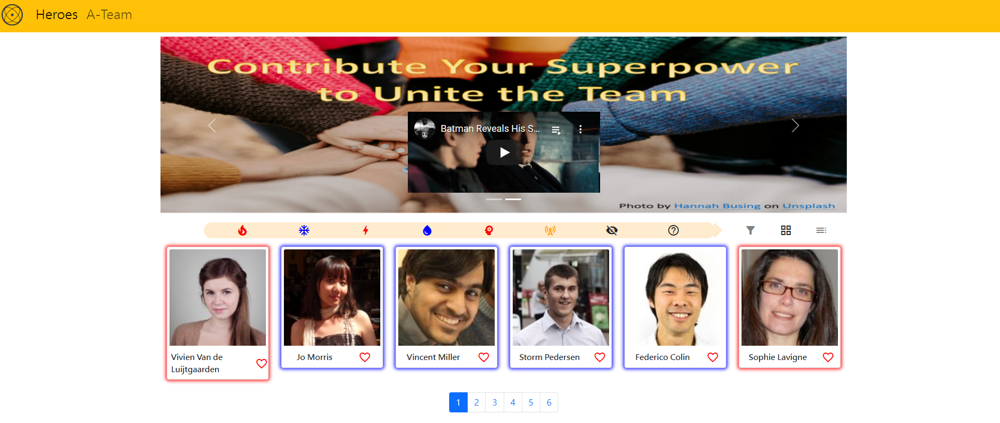

# HeroesWbeSite_UserAPI

**_Basic HTML、CSS、JS_**

**Webpage**: https://wuwachon.github.io/2-2_S3A13_HeroWebSite_UserAPI/


## Clone to local

Terminal comment:

```
git clone https://github.com/wuwachon/2-2_S3A13_HeroWebSite_UserAPI   // download to local

cd 2-2_S3A13_HeroWebSite_UserAPI   // move to file

code .  // open in VS Code
```

Run the live server on VS Code to check the webpage instantly.

## Practice the skills：

- Use axios to get data from API
- Bootstrap to build a basic website
- Google fonts icons
- JS DOM selectors render view panel from specific datas
- Local Storage
- Naming convention for functions

### axios

**Install axios by using CDN**

```
<script src="https://unpkg.com/axios/dist/axios.min.js"></script>
```

or

```
<script src="https://cdn.jsdelivr.net/npm/axios/dist/axios.min.js"></script>
```

**API resource from [RANDOM USER GENERATOR](https://randomuser.me/)**

```
// order 35 random results from API_URL
const USER_URL = "https://randomuser.me/api/?results=35";
```

This API accept many different parameters such as how many results from an order, result gender,...etc.

### [bootstrap](https://getbootstrap.com/)

**CSS link into HTML <head>**

```
<link href="https://cdn.jsdelivr.net/npm/bootstrap@5.1.3/dist/css/bootstrap.min.css" rel="stylesheet" integrity="sha384-1BmE4kWBq78iYhFldvKuhfTAU6auU8tT94WrHftjDbrCEXSU1oBoqyl2QvZ6jIW3" crossorigin="anonymous">
```

**JS into HTML <body> end before </body>**

```
<script src="https://cdn.jsdelivr.net/npm/bootstrap@5.1.3/dist/js/bootstrap.bundle.min.js" integrity="sha384-ka7Sk0Gln4gmtz2MlQnikT1wXgYsOg+OMhuP+IlRH9sENBO0LRn5q+8nbTov4+1p" crossorigin="anonymous"></script>
```

or

```
<script src="https://cdn.jsdelivr.net/npm/@popperjs/core@2.10.2/dist/umd/popper.min.js" integrity="sha384-7+zCNj/IqJ95wo16oMtfsKbZ9ccEh31eOz1HGyDuCQ6wgnyJNSYdrPa03rtR1zdB" crossorigin="anonymous"></script>
<script src="https://cdn.jsdelivr.net/npm/bootstrap@5.1.3/dist/js/bootstrap.min.js" integrity="sha384-QJHtvGhmr9XOIpI6YVutG+2QOK9T+ZnN4kzFN1RtK3zEFEIsxhlmWl5/YESvpZ13" crossorigin="anonymous"></script>
```

**Main components in this practice**

- [Navbar](https://getbootstrap.com/docs/5.1/components/navbar/)
- [Carousel](https://getbootstrap.com/docs/5.1/components/carousel/)
- [Card](https://getbootstrap.com/docs/5.1/components/card/)
- [Buttons](https://getbootstrap.com/docs/5.1/components/buttons/)
- [Modal](https://getbootstrap.com/docs/5.1/components/modal/)
- [Paginator](https://getbootstrap.com/docs/5.1/components/pagination/)
- [iframe](https://getbootstrap.com/docs/5.1/helpers/ratio/#example)

### [Google Fonts](https://fonts.google.com/)

**CSS link into HTML <head>**

```
<link href="https://fonts.googleapis.com/icon?family=Material+Icons" rel="stylesheet">
```

### JS DOM selectors

- render view panel from raw datas
- render view panel by different display ways
- render view panel by filter datas

### Local Storage

Event Listener tied on the heart icon that push into or splice from the Local Storage datas.

### Naming convention for functions

Still need to improve the descriptive naming skill.
